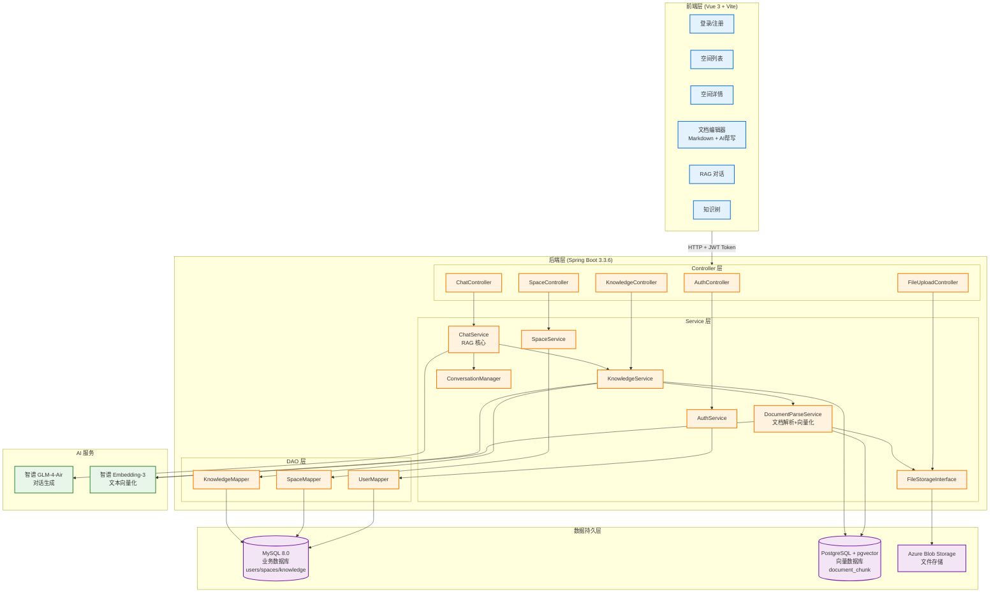
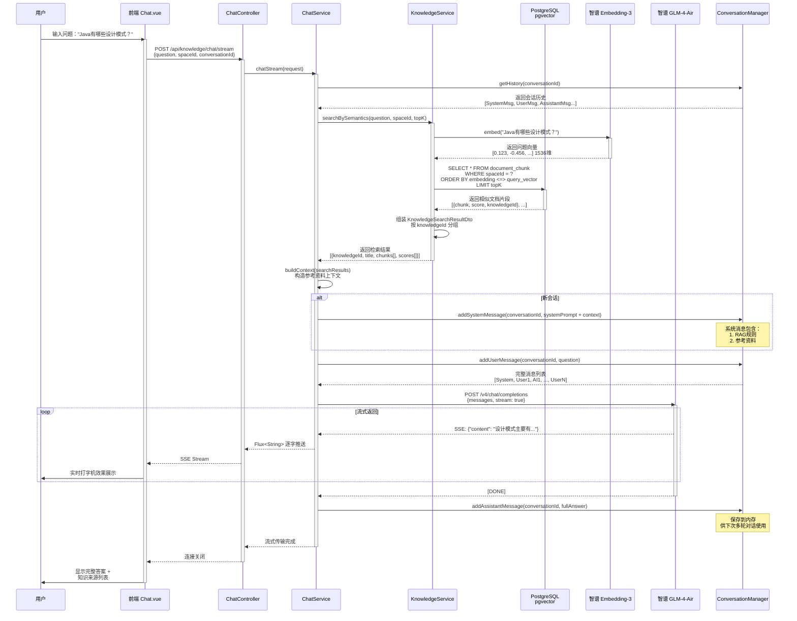

# 享记（XiangJi）项目架构文档

## 项目概述

**享记** 是一个 **RAG（检索增强生成）知识库管理系统**，集知识管理、AI 对话、文档处理于一体。用户可以上传文档、手工编写 Markdown 笔记，系统通过 AI 实现智能问答和内容生成辅助。

### 核心功能

1. **知识管理**：支持多空间、树形知识结构、Markdown 编辑和文档上传
2. **RAG 问答**：语义检索 + 大语言模型回答，精准引用知识来源
3. **AI 写作辅助**：基于当前编辑内容的逐字生成和续写
4. **向量检索**：基于 pgvector 的语义相似度检索
5. **文档解析**：支持 PDF、DOCX、TXT 等格式自动提取和向量化

---

## 技术栈

### 后端

| 组件 | 版本 | 用途 |
|------|------|------|
| Spring Boot | 3.3.6 | Web 框架 |
| Spring AI | 1.0.0-M6 | LLM 集成、向量化、文本分割 |
| Spring Security | 3.3.6 | 身份验证和授权 |
| MyBatis | 3.0.3 | 数据库 ORM |
| PostgreSQL + pgvector | 15+ | 向量存储数据库 |
| MySQL | 8.0 | 业务数据库 |
| 智谱 AI | GLM-4-Air | LLM 模型，Embedding-3 向量模型 |
| Tika | - | 文档内容提取 |
| JWT | - | Token 认证 |

### 前端

| 工具 | 版本 | 用途 |
|------|------|------|
| Vue | 3 | 前端框架 |
| Vite | - | 构建工具 |
| Element Plus | - | UI 组件库 |
| Axios | - | HTTP 请求 |
| Vue Router | - | 路由管理 |
| Marked.js | - | Markdown 渲染 |
| Highlight.js | - | 代码高亮 |
| Vditor | - | Markdown 编辑器 |
| docx-preview | - | Word 文档预览 |

---

## 系统架构图



---

## 核心模块详解

### 1. 认证模块 (Authentication)

**入口**：`AuthController`

**流程**：

```
用户输入用户名/密码 
  ↓
AuthController.login()
  ↓
AuthService.login()
  ├─ UserMapper.selectByUsername()  [从MySQL查询用户]
  ├─ BCrypt 密码验证
  └─ 生成 JWT Token (有效期24小时)
  ↓
返回 Token + 用户信息到前端
  ↓
前端存储 Token 到 localStorage，后续请求头中携带
```

**数据库表**：

```sql
CREATE TABLE users (
  id BIGINT PRIMARY KEY,
  username VARCHAR(255) UNIQUE,
  password VARCHAR(255),  -- BCrypt加密
  email VARCHAR(255),
  created_at TIMESTAMP,
  updated_at TIMESTAMP
);
```

**关键代码**：

- `AuthService.login()` - 验证用户并生成 Token
- `JwtTokenProvider` - JWT 生成与解析（自定义工具类）
- `SecurityConfig` - 当前所有 API 无需认证（课程简化）

---

### 2. 空间与知识管理模块 (Space & Knowledge)

**核心概念**：

- **Space（空间）**：独立的知识库，对应用户的学习主题（如"Java"、"前端"）
- **Knowledge（知识）**：属于某个 Space 的文档或笔记，支持树形结构

**数据库表**：

```sql
CREATE TABLE spaces (
  id BIGINT PRIMARY KEY,
  user_id BIGINT,
  name VARCHAR(255),
  description TEXT,
  created_at TIMESTAMP,
  updated_at TIMESTAMP
);

CREATE TABLE knowledge (
  id BIGINT PRIMARY KEY,
  space_id BIGINT,
  title VARCHAR(255),
  type ENUM('MANUAL', 'DOC'),    -- 手工笔记 或 文档
  content LONGTEXT,               -- MANUAL: Markdown内容
  parent_id BIGINT,               -- 树形结构：父节点ID
  blob_key VARCHAR(255),          -- DOC: Azure存储路径
  parse_job VARCHAR(50),          -- DOC: PENDING/RUNNING/DONE/FAILED
  created_at TIMESTAMP,
  updated_at TIMESTAMP
);
```

**知识类型**：

1. **MANUAL**（手工编辑）
   - 用户在前端 Vditor 编辑器中编写 Markdown
   - 保存到 MySQL 的 `content` 字段
   - 自动参与向量化（DocumentParseService.embedMarkdown）

2. **DOC**（文档上传）
   - 用户上传 PDF/DOCX/TXT 等文件
   - 文件存储到 Azure Blob Storage，`blob_key` 记录存储路径
   - 后台异步解析并向量化（DocumentParseService.parseAndEmbed）

**知识树结构**：

- 通过 `parent_id` 形成树形
- 支持任意深度嵌套
- 删除知识时级联删除子知识

**API 流程**（创建知识）：

```
前端提交 KnowledgeCreateRequestDto
  ↓
KnowledgeController.createKnowledge()
  ↓
KnowledgeService.create()
  ├─ 校验 spaceId、title、type、parentId
  ├─ 插入 MySQL knowledge 表
  └─ 触发异步处理
      ├─ MANUAL: DocumentParseService.embedMarkdown()
      │   └─ content → TokenTextSplitter → VectorStore
      └─ DOC: DocumentParseService.parseAndEmbed()
          ├─ blob_key → 从 Azure 下载
          ├─ Tika 解析提取内容
          ├─ TokenTextSplitter 分片
          └─ 加入 VectorStore (带元数据)
  ↓
返回创建结果
```

---

### 3. 文档解析与向量化模块 (DocumentParse & Embedding)

**核心类**：`DocumentParseService`

**处理流程**：

#### 3.1 文档类知识（DOC）

```
用户上传 PDF/DOCX/TXT
  ↓
FileUploadController.upload()
  ├─ 保存到 Azure Blob Storage
  └─ 返回 blobKey
  ↓
前端调用创建知识 API，传入 blobKey
  ↓
KnowledgeService.create()
  ├─ 设置 parseJob = "PENDING"
  └─ 调用 DocumentParseService.parseAndEmbed(knowledgeId, blobKey)
      @Async // 异步执行，不阻塞请求
      ├─ 设置 parseJob = "RUNNING"
      ├─ fileStorageService.download(blobKey) [从Azure获取文件流]
      ├─ TikaDocumentReader.read() [内容提取]
      │  └─ 返回 List<Document>，每个 Document 是一页或一个段落
      ├─ stripInvalidSource() [清理 Tika 生成的无效元数据]
      ├─ TokenTextSplitter.split() [语义分片]
      │  ├─ 每块限制 Token 数（通常 512-1024）
      │  └─ 各块间有 overlap 以保持上下文连续
      ├─ 为每个分片添加元数据
      │  └─ {knowledgeId, spaceId, blobKey, filename}
      ├─ vectorStore.add() [批量插入向量库]
      │  └─ Spring AI 自动调用 EmbeddingModel (智谱 Embedding-3)
      │     转换为 1536 维向量，存储在 PostgreSQL pgvector
      ├─ 设置 parseJob = "DONE"
      └─ 返回 (异步完成)
```

#### 3.2 手工笔记（MANUAL）

```
用户编辑 Markdown 并保存
  ↓
KnowledgeService.update()
  ├─ 更新 MySQL content 字段
  └─ 调用 DocumentParseService.embedMarkdown()
      ├─ 判断长度
      │  ├─ < 100 字符：作为单块直接入向量库
      │  └─ >= 100 字符：使用 TokenTextSplitter 分片
      ├─ 添加元数据 {knowledgeId, spaceId}
      ├─ vectorStore.add() [调用向量化 API]
      └─ 完成（同步）
```

**关键配置**：

```yaml
knowledge:
  vector:
    min-length: 100  # 小于该长度的文本不分片，按单块入库
```

**向量维度**：

- 模型：智谱 Embedding-3
- 维度：1536 或 2048（可配置，见 application.yml）
- 距离度量：余弦相似度 (COSINE_DISTANCE)

---

### 4. RAG 对话模块 (Chat Service)

**核心类**：`ChatService`

**RAG（Retrieval Augmented Generation）流程**：

```
用户提问："Java 有哪些设计模式？"
  ↓
ChatController.chat() / chatStream()
  ├─ 参数：question, spaceId, conversationId, topK, similarityThreshold
  └─ 调用 ChatService.chat() / chatStream()
      ↓
    1. 创建或获取会话 ID
      ├─ 新会话：ConversationManager.createConversation()
      └─ 继续会话：从参数中获取
      ↓
    2. 语义检索 (向量相似度)
      ├─ KnowledgeService.searchBySemantics()
      │  ├─ EmbeddingModel.embed(question) [问题向量化]
      │  ├─ VectorStore.search() [相似度检索]
      │  │  ├─ 查询条件：
      │  │  │  ├─ 相似度阈值（similarityThreshold）
      │  │  │  ├─ 返回条数（topK）
      │  │  │  └─ spaceId 过滤（只查该 space 的知识）
      │  │  └─ 排序：按相似度从高到低
      │  └─ 返回 List<KnowledgeSearchResultDto>
      │      └─ {knowledgeId, title, chunks[], scores[]}
      │
      ├─ 无检索结果
      │  └─ 返回："抱歉，我在知识库中没有找到相关信息"
      │
      ├─ 有检索结果
      │  ├─ 每条结果限制返回 chunksPerKnowledge 个片段
      │  └─ 构造 context 字符串
      │      ```
      │      [知识文档标题]
      │      - 相关片段1
      │      - 相关片段2
      │      ...
      │      ```
      │
    3. 构造大模型 Prompt
      ├─ 系统消息（System）[仅新会话添加一次]
      │  ```
      │  你是一个专业的知识库助手。请根据以下参考资料回答用户的问题。
      │  
      │  **重要规则：**
      │  1. 只能基于提供的参考资料回答问题
      │  2. 如果参考资料中没有相关信息，请明确告知用户...
      │  3. 回答要准确、简洁、专业
      │  4. 可以引用资料中的原文，并说明来源
      │  5. 返回格式为 MARKDOWN
      │  6. **强制要求**：回答结尾必须添加"### 📚 知识来源"部分
      │  
      │  **参考资料：**
      │  {context}
      │  ```
      ├─ 用户历史消息（User）[会话保留]
      └─ AI 历史回复（Assistant）[会话保留]
      ↓
    4. 调用大模型（智谱 GLM-4-Air）
      ├─ ChatClient.prompt().messages(...).call().content()
      │  [非流式] 一次性返回完整回答
      │
      └─ ChatClient.prompt().messages(...).stream().content()
         [流式] 逐字返回，前端逐字展示打字机效果
      ↓
    5. 保存会话历史
      ├─ ConversationManager.addAssistantMessage(conversationId, answer)
      └─ 下次会话会读取历史进行上下文理解
      ↓
    6. 构造响应
      └─ ChatResponseDto {
           answer,           // AI 回答
           conversationId,   // 会话 ID，前端保存
           sources,          // 知识来源：{knowledgeId, title, snippet}
           retrievedCount    // 检索到的知识片段数
         }
```

**关键参数**：

| 参数 | 说明 | 默认值 |
|------|------|--------|
| `topK` | 返回最相似的前 K 条知识 | 5 |
| `similarityThreshold` | 相似度阈值，低于该值的结果被过滤 | 0.6 |
| `chunksPerKnowledge` | 每条知识最多返回多少个片段 | 2 |

**系统 Prompt 设计**：

- 强制限制：只基于参考资料回答
- 强制引用：回答必须附带知识来源
- 严禁包裹：不允许使用 ```markdown 包裹整个回答
- 格式规范：Markdown 格式

**会话管理**：

- 每个会话独立保存消息历史
- 支持多轮对话（会话内的上下文理解）
- 前端可清空或切换会话

---

### 5. 文件存储模块 (File Storage)

**接口**：`FileStorageInterface`

**实现策略**：

- 目前实现：`AzureBlobStorageImpl`
- 可扩展：支持本地文件系统、S3 等

**API 流程**（文件上传）：

```
前端选择文件
  ↓
FileUploadController.upload()
  ├─ 接收 MultipartFile
  ├─ 校验文件类型和大小
  ├─ fileStorageService.upload(file)
  │  └─ AzureBlobStorageImpl.upload()
  │     ├─ 生成唯一 blobKey (knowledge/{UUID})
  │     └─ 上传到 Azure Blob Storage
  ├─ 返回 FileUploadResponseDto {blobKey}
  └─ 前端得到 blobKey，后续创建知识时传入
```

**配置**：

```yaml
azure:
  blob:
    container: knowledge-files
    base-folder: knowledge
    connection-string: ${AZURE_STORAGE_CONNECTION_STRING}
```

---

### 6. 向量存储配置 (Vector Store)

**配置类**：`VectorStoreConfig`

**数据库**：PostgreSQL + pgvector 插件

```java
@Configuration
public class VectorStoreConfig {
    @Bean
    public VectorStore vectorStore(
            DataSource postgresDataSource,
            EmbeddingModel embeddingModel) {
        return PgVectorStore.builder(jdbcTemplate, embeddingModel)
                .dimensions(1536)  // 向量维度
                .distanceType(COSINE_DISTANCE)  // 余弦相似度
                .initializeSchema(true)  // 自动创建表
                .build();
    }
}
```

**向量库表结构**（自动创建）：

```sql
CREATE TABLE IF NOT EXISTS document_chunk (
    id SERIAL PRIMARY KEY,
    embedding vector(1536),  -- 向量（余弦距离）
    metadata jsonb,
    content text
);

-- 向量索引加速相似度检索
CREATE INDEX ON document_chunk USING ivfflat (embedding vector_cosine_ops);
```

**元数据示例**：

```json
{
  "knowledgeId": 123,
  "spaceId": 456,
  "blobKey": "knowledge/file-uuid",
  "filename": "my-document.pdf"
}
```

---

### 7. AI 写作辅助模块 (Document & AI)

**使用场景**：用户在编辑 Markdown 笔记时，点击 "AI 帮写" 按钮

**前端流程**：

```
用户在 Document.vue 编辑器中点击 "AI 帮写"
  ↓
用户输入 Prompt（例："写一段关于 Vue3 响应式原理的介绍"）
  ↓
前端构造完整 Prompt
  ├─ 包含当前编辑器内容（作为上下文）
  ├─ 用户输入（生成需求）
  └─ 严禁规则：不使用代码块、不输出分隔符
  ↓
ChatController.simpleStream(question)
  └─ ChatService.simpleLlmStream(prompt)
      ├─ 调用大模型（不使用 RAG，仅单轮）
      └─ 流式返回生成内容
          ├─ SSE 格式逐字推送
          └─ 前端实时渲染到编辑器
  ↓
用户选择"接受"或"撤销"生成的内容
```

**关键特性**：

- **流式输出**：逐字返回，前端打字机效果
- **不使用 RAG**：直接调用大模型，无知识库检索
- **上下文保持**：将当前编辑内容传入，确保生成的内容贴合原有文档

**Prompt 设计**：

```
你是一个Markdown写作助手。以下是当前文档内容作为上下文：
<context>
{当前编辑内容}
</context>

用户需求：{用户输入的Prompt}

请直接输出符合用户需求的Markdown内容。
1. **严禁使用 ```markdown 或 ``` 包裹整个回答**。
2. **严禁输出 --- 或其他分隔符**。
3. 不要添加任何说明文字。
直接开始输出Markdown文本。
```

---

## RAG 对话数据流时序图



**关键步骤说明**：

1. **会话管理**：首次提问创建新会话，后续提问使用相同 `conversationId` 实现多轮对话
2. **向量检索**：问题先转为向量，然后在 pgvector 中进行余弦相似度搜索
3. **RAG 上下文**：检索到的知识片段整合为"参考资料"，注入到系统 Prompt
4. **流式响应**：大模型逐字返回，前端实时展示（SSE 协议）
5. **历史保留**：每轮问答都保存，下次提问时大模型能理解上下文

---

## 数据流总结

### 场景 1：上传文档并提问

```
用户上传 PDF 文档
  ↓ [同步] FileUploadController
  ├─→ Azure Blob Storage (存储文件)
  └─→ 返回 blobKey
  ↓
用户创建知识（关联 blobKey）
  ↓ [异步] DocumentParseService
  ├─→ TikaDocumentReader (提取内容)
  ├─→ TokenTextSplitter (分片)
  ├─→ EmbeddingModel (向量化)
  └─→ PgVectorStore (存储向量)
  ↓
用户提问："这份文档讲了什么？"
  ↓ [同步] ChatService.chat()
  ├─→ 问题向量化 → Embedding-3
  ├─→ 相似度搜索 → PgVectorStore
  ├─→ 构造 Prompt（RAG Context）
  ├─→ 调用大模型 → GLM-4-Air
  └─→ 返回答案 + 知识来源

┌─ 全链路完整性：文件 → 内容 → 向量 → 检索 → 对话 ─┐
```

### 场景 2：编写笔记并编辑优化

```
用户手工编写 Markdown
  ↓
保存知识
  ↓ [同步] DocumentParseService.embedMarkdown()
  ├─→ TokenTextSplitter (分片)
  ├─→ EmbeddingModel (向量化)
  └─→ PgVectorStore (存储向量)
  ↓
用户点击 "AI 帮写"，输入 Prompt
  ↓ [流式] ChatService.simpleLlmStream()
  ├─→ 不使用向量库，仅基于大模型
  ├─→ 考虑当前编辑内容（上下文）
  └─→ 返回生成内容（打字机效果）
  ↓
用户接受 → 插入编辑器

┌─ 核心：当前编辑内容 + 用户Prompt → LLM 生成 → 用户选择 ─┐
```

### 场景 3：多轮对话（会话保持）

```
会话 1：用户提问 A
  ↓ ChatService.chat()
  ├─→ ConversationManager.createConversation() [新会话]
  ├─→ 向量检索相关知识
  ├─→ 构造系统消息 + 用户消息
  ├─→ 调用大模型 → 获得回答 A
  ├─→ ConversationManager.addAssistantMessage() [保存回答]
  └─→ 返回 conversationId + 回答 A
  ↓
会话 2：用户追问相关问题 B（传入同一 conversationId）
  ↓ ChatService.chat()
  ├─→ ConversationManager.getHistory(conversationId) [读取历史]
  │   └─ [系统消息, 用户消息 A, AI回答 A] ← 历史上下文
  ├─→ 新的向量检索（问题 B）
  ├─→ 构造新的 Prompt（系统消息 + 历史 + 新问题）
  ├─→ 调用大模型 → 获得回答 B（理解问题 A 的上下文）
  ├─→ ConversationManager.addAssistantMessage() [保存回答]
  └─→ 返回回答 B

┌─ 核心：会话历史保持，大模型能理解多轮对话的上下文 ─┐
```

---

## 关键设计决策

### 1. 同步 vs 异步

| 操作 | 方式 | 原因 |
|------|------|------|
| 文件上传到 Azure | 同步 | 快速返回 blobKey |
| 文档解析 + 向量化 | 异步 (@Async) | 耗时操作，不阻塞请求 |
| 文件大小：支持单文件 200MB | 配置 | 支持课程教学资料 |
| Markdown 向量化 | 同步 | 体积小，耗时少 |
| 向量检索 + LLM 调用 | 同步 | 用户等待答案 |

### 2. 单表 vs 多表

| 模块 | 设计 | 说明 |
|------|------|------|
| users | 单表 | 简单用户模型，未来可扩展 tenant |
| spaces | 单表 | 用户的知识库空间，支持多对一 |
| knowledge | 单表 | 树形结构通过 parent_id 实现 |
| vector store | 独立 PG | MySQL 不支持向量，PostgreSQL 专精向量检索 |

### 3. 向量库设计

- **为何独立 PostgreSQL？**
  - 业务数据 (MySQL) 与向量数据 (PG) 分离
  - PG 的 pgvector 插件性能优异，支持 HNSW 索引加速
  - 易于替换（不依赖 MySQL）

- **向量维度与距离**
  - 维度：1536（智谱 Embedding-3）
  - 距离：余弦相似度（适合文本检索）
  - 索引：IVFFLAT（权衡速度与精度）

### 4. RAG Prompt 工程

- **强制规则**：禁用代码块、禁用分隔符
- **强制来源**：回答必须附带知识出处
- **优势**：用户信任度高，可溯源

### 5. 文件存储策略

- **为何使用 Azure Blob？**
  - 云存储可靠性高
  - 支持大文件
  - 易于扩展

- **本地开发替代**
  - 可自实现 `FileStorageInterface` 的本地文件系统版本

---

## 关键流程图

### ChatService.chat() 详细流程

```
┌────────────────────────────────┐
│   用户问题 + 参数信息         │
│   {question, spaceId, topK...} │
└────────────────────────────────┘
            ↓
┌────────────────────────────────┐
│  检查或创建 conversationId    │
└────────────────────────────────┘
            ↓
┌────────────────────────────────────────────────────┐
│  KnowledgeService.searchBySemantics()             │
│  ├─ question 向量化                              │
│  ├─ VectorStore 相似度搜索                        │
│  └─ 返回 List<KnowledgeSearchResultDto>          │
└────────────────────────────────────────────────────┘
            ↓
        ┌─────────────────────────┐
        │ 检索结果为空？          │
        └────────┬────────────────┘
        ┌─────────────────────────┐
        │ 是 → 返回默认回答      │
        │ 否 → 继续             │
        └─────────────────────────┘
            ↓
┌────────────────────────────────┐
│  构造 RAG Context             │
│  {知识标题 + 相关片段}        │
└────────────────────────────────┘
            ↓
┌────────────────────────────────────────────────────┐
│  构造 Messages 列表                              │
│  ├─ [1] 系统消息 (仅新会话)                       │
│  │       + SYSTEM_PROMPT_TEMPLATE (包含 Context) │
│  ├─ [2] 历史用户消息                             │
│  └─ [3] 新用户消息                               │
└────────────────────────────────────────────────────┘
            ↓
┌────────────────────────────────────────────────────┐
│  ChatClient.prompt().messages(...).call()        │
│  └─ 调用智谱 GLM-4-Air API                       │
└────────────────────────────────────────────────────┘
            ↓
┌────────────────────────────────┐
│  LLM 返回答案                 │
└────────────────────────────────┘
            ↓
┌────────────────────────────────┐
│  保存到会话历史                │
└────────────────────────────────┘
            ↓
┌────────────────────────────────────────────────────┐
│  构造 ChatResponseDto                            │
│  ├─ answer (LLM回答)                             │
│  ├─ conversationId (会话ID)                      │
│  ├─ sources (知识来源列表)                       │
│  └─ retrievedCount (检索片段数)                  │
└────────────────────────────────────────────────────┘
            ↓
┌────────────────────────────────┐
│  返回响应到前端                │
└────────────────────────────────┘
```

---

## 性能考量

### 1. 向量搜索性能

- **索引**：IVFFLAT（IVF + Flat Quantization）
- **并发**：PostgreSQL 天生支持并发查询
- **优化**：topK 过大时性能下降，建议 topK ≤ 10

### 2. 文档解析性能

- **异步处理**：不阻塞用户请求
- **分片大小**：TokenTextSplitter 默认 512 tokens，影响向量库大小与检索速度

### 3. LLM 调用延迟

- **模型延迟**：智谱 GLM-4-Air 响应时间约 2-5 秒
- **网络延迟**：API 调用耗时，考虑超时设置（application.yml: timeout: 60000ms）

---

## 扩展点

### 1. 支持多个 LLM 提供商

```java
// 当前：智谱 AI
spring.ai.zhipuai.api-key

// 扩展：OpenAI、Claude 等
// 修改 ChatModel Bean 的实现
```

### 2. 支持多种文件格式

```java
// 当前：Tika 已支持 PDF、DOCX、TXT 等
// 扩展：自定义解析器（如特殊的 Excel、数据库 SQL）
```

### 3. 支持多种文件存储

```java
// 当前：Azure Blob Storage
// 扩展：
// - LocalFileStorageImpl (本地文件系统)
// - S3StorageImpl (AWS S3)
// - MinIOStorageImpl (私有云)
```

### 4. 向量库迁移

```java
// 当前：PostgreSQL + pgvector
// 扩展：
// - Pinecone (SaaS)
// - Weaviate (开源)
// - Milvus (开源)
```

### 5. 权限与多租户

```java
// 当前：用户可访问自己的所有 Space
// 扩展：
// - Space 级别的分享与权限
// - 多租户隔离（Tenant Architecture）
```

---

## 部署架构

### 本地开发环境

```
Local Machine
├─ Frontend: npm run dev (Vite 开发服务器, 端口 5173)
├─ Backend: mvn spring-boot:run (Spring Boot, 端口 8080)
├─ MySQL: localhost:3306
├─ PostgreSQL: localhost:5432
└─ Azure Blob Storage: 云端
```

### 生产环境（Azure VM）

```
Azure VM (Ubuntu 20.04)
├─ Frontend: Nginx (静态文件 + 反向代理)
│   ├─ 端口 80 → 443 (HTTP → HTTPS)
│   └─ location /api → http://127.0.0.1:8080
├─ Backend: Java 17 (java -jar)
│   └─ 端口 8080 (内部)
├─ MySQL: 本机或 Docker
│   └─ 端口 3306
├─ PostgreSQL + pgvector: 本机或 Docker
│   └─ 端口 5432
└─ Azure Blob Storage: 云端
```

---

## 总结

享记项目是一个**完整的 RAG 知识库系统**，包含以下核心能力：

1. **知识管理**：树形结构，支持手工笔记与文档上传
2. **智能检索**：向量相似度搜索，精准匹配用户查询
3. **AI 对话**：多轮会话，记忆历史上下文
4. **内容生成**：AI 写作辅助，逐字打字机效果
5. **可溯源性**：回答必须引用知识来源，提升用户信任

**架构优势**：

- 业务库 (MySQL) 与向量库 (PG) 分离，便于扩展
- 异步处理文档，不阻塞用户
- RAG 框架确保回答基于知识库，减少幻觉
- 前后端分离，易于独立迭代

**适用场景**：

- 团队知识库建设
- 个人学习笔记管理
- FAQ 系统
- 文档智能问答
