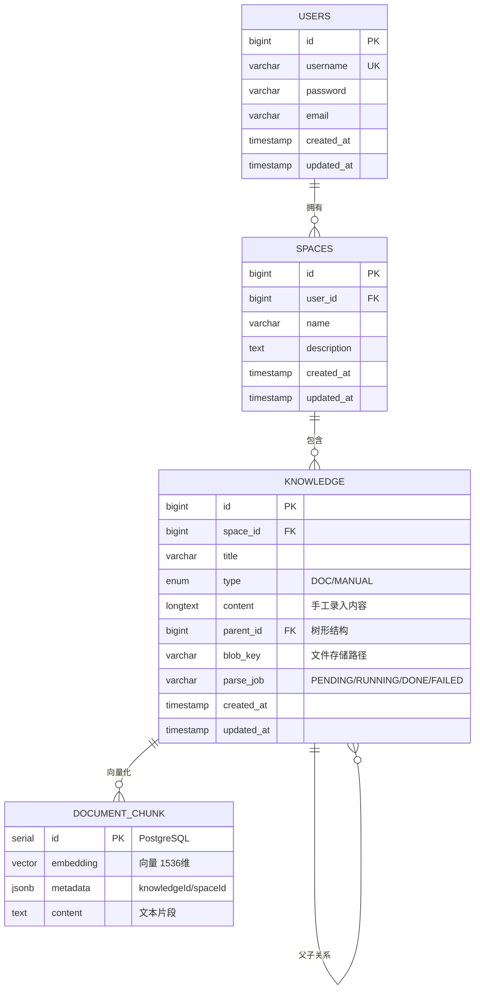

# 数据库架构设计文档

## 一、整体 ER 关系梳理（核心逻辑）

模型可以抽象成一句话：

> **用户 → 空间 → 知识 → 向量（RAG）**

### 数据库拆分策略

| 数据库 | 表 | 用途 |
|--------|-----|------|
| **MySQL 8.0** | `users` | 业务数据：用户信息 |
| **MySQL 8.0** | `spaces` | 业务数据：知识库空间 |
| **MySQL 8.0** | `knowledge` | 业务数据：知识条目 |
| **PostgreSQL + pgvector** | `document_chunk` | 向量数据：RAG 检索 |

**设计原则**：业务数据与向量数据分离，MySQL 负责结构化数据，PostgreSQL + pgvector 负责向量检索。

---

### ER 图（Mermaid）



---

## 二、MySQL 数据库表详解

### 1️⃣ 用户表（users）

* **一个用户可以拥有多个知识库空间**
* `users.id` ← `spaces.user_id`

```text
users 1 ──── N spaces
```

用户是**权限和所有权的最外层边界**

#### 表结构

| 字段 | 类型 | 约束 | 说明 |
|------|------|------|------|
| `id` | BIGINT | PRIMARY KEY | 主键 |
| `username` | VARCHAR(255) | UNIQUE NOT NULL | 用户名（唯一） |
| `password` | VARCHAR(255) | NOT NULL | BCrypt 加密密码 |
| `email` | VARCHAR(255) | | 邮箱 |
| `created_at` | TIMESTAMP | DEFAULT CURRENT_TIMESTAMP | 创建时间 |
| `updated_at` | TIMESTAMP | DEFAULT CURRENT_TIMESTAMP ON UPDATE | 更新时间 |

#### DDL

```sql
CREATE TABLE users (
    id BIGINT PRIMARY KEY AUTO_INCREMENT,
    username VARCHAR(255) UNIQUE NOT NULL,
    password VARCHAR(255) NOT NULL,
    email VARCHAR(255),
    created_at TIMESTAMP DEFAULT CURRENT_TIMESTAMP,
    updated_at TIMESTAMP DEFAULT CURRENT_TIMESTAMP ON UPDATE CURRENT_TIMESTAMP
);
```

---

### 2️⃣ 知识库空间表（spaces）

空间是一个**逻辑知识库容器**，用于：

* 按项目 / 课程 / 研究方向 / 公司部门划分
* 作为 **RAG 检索与权限隔离的最小单元**

```text
spaces 1 ──── N knowledge
```

* `spaces.id` ← `knowledge.space_id`

#### 表结构

| 字段 | 类型 | 约束 | 说明 |
|------|------|------|------|
| `id` | BIGINT | PRIMARY KEY | 主键 |
| `user_id` | BIGINT | FOREIGN KEY | 外键 → users.id |
| `name` | VARCHAR(255) | NOT NULL | 空间名称 |
| `description` | TEXT | | 空间描述 |
| `created_at` | TIMESTAMP | DEFAULT CURRENT_TIMESTAMP | 创建时间 |
| `updated_at` | TIMESTAMP | DEFAULT CURRENT_TIMESTAMP ON UPDATE | 更新时间 |

#### DDL

```sql
CREATE TABLE spaces (
    id BIGINT PRIMARY KEY AUTO_INCREMENT,
    user_id BIGINT NOT NULL,
    name VARCHAR(255) NOT NULL,
    description TEXT,
    created_at TIMESTAMP DEFAULT CURRENT_TIMESTAMP,
    updated_at TIMESTAMP DEFAULT CURRENT_TIMESTAMP ON UPDATE CURRENT_TIMESTAMP,
    FOREIGN KEY (user_id) REFERENCES users(id) ON DELETE CASCADE
);
```

---

### 3️⃣ 知识条目表（knowledge）——核心表

这是**整个系统最关键的表**，它统一承载了：

| 类型 | 枚举值 | 说明 |
|------|--------|------|
| 文档类 | `DOC` | 上传的 PDF/DOCX 等文件 |
| 手工录入 | `MANUAL` | Markdown 笔记 |

#### 表结构

| 字段 | 类型 | 约束 | 说明 |
|------|------|------|------|
| `id` | BIGINT | PRIMARY KEY | 主键 |
| `space_id` | BIGINT | FOREIGN KEY | 外键 → spaces.id |
| `title` | VARCHAR(255) | NOT NULL | 知识标题 |
| `type` | ENUM('DOC', 'MANUAL') | NOT NULL | 知识类型 |
| `content` | LONGTEXT | | 手工录入的 Markdown 内容 |
| `parent_id` | BIGINT | FOREIGN KEY | 外键 → knowledge.id（树形结构） |
| `blob_key` | VARCHAR(255) | | 文件存储路径（Azure Blob） |
| `parse_job` | VARCHAR(50) | | 文档解析状态：PENDING/RUNNING/DONE/FAILED |
| `created_at` | TIMESTAMP | DEFAULT CURRENT_TIMESTAMP | 创建时间 |
| `updated_at` | TIMESTAMP | DEFAULT CURRENT_TIMESTAMP ON UPDATE | 更新时间 |

#### 层级结构（知识树）

```sql
parent_id BIGINT
FOREIGN KEY (parent_id) REFERENCES knowledge(id)
```

支持：

* 目录 / 子目录
* 手工结构化知识的**父子节点**

```text
knowledge (父)
   └── knowledge (子)
```

#### DDL

```sql
CREATE TABLE knowledge (
    id BIGINT PRIMARY KEY AUTO_INCREMENT,
    space_id BIGINT NOT NULL,
    title VARCHAR(255) NOT NULL,
    type ENUM('DOC', 'MANUAL') NOT NULL,
    content LONGTEXT,
    parent_id BIGINT,
    blob_key VARCHAR(255),
    parse_job VARCHAR(50),
    created_at TIMESTAMP DEFAULT CURRENT_TIMESTAMP,
    updated_at TIMESTAMP DEFAULT CURRENT_TIMESTAMP ON UPDATE CURRENT_TIMESTAMP,
    FOREIGN KEY (space_id) REFERENCES spaces(id) ON DELETE CASCADE,
    FOREIGN KEY (parent_id) REFERENCES knowledge(id) ON DELETE CASCADE
);
```

---

## 三、PostgreSQL 向量数据库表详解

### 向量存储表（document_chunk）

**位于 PostgreSQL 数据库**，使用 **pgvector 扩展**，用于 RAG 语义检索。

#### 表结构

| 字段 | 类型 | 说明 |
|------|------|------|
| `id` | SERIAL | 主键（自增） |
| `embedding` | VECTOR(1536) | 向量（1536 维，智谱 Embedding-3） |
| `metadata` | JSONB | 元数据：`{knowledgeId, spaceId, blobKey, filename}` |
| `content` | TEXT | 文本片段 |

#### 索引（IVFFLAT）

```sql
CREATE INDEX ON document_chunk USING ivfflat (embedding vector_cosine_ops);
```

**索引说明**：
* **IVFFLAT**：反向文件索引 + 扁平量化，适合中等规模向量检索
* **vector_cosine_ops**：余弦相似度运算符

#### 元数据示例

```json
{
  "knowledgeId": 123,
  "spaceId": 456,
  "blobKey": "knowledge/uuid-12345",
  "filename": "java-design-patterns.pdf"
}
```

#### DDL（Spring AI 自动创建）

```sql
CREATE EXTENSION IF NOT EXISTS vector;

CREATE TABLE IF NOT EXISTS document_chunk (
    id SERIAL PRIMARY KEY,
    embedding vector(1536),
    metadata jsonb,
    content text
);

CREATE INDEX IF NOT EXISTS document_chunk_embedding_idx 
ON document_chunk USING ivfflat (embedding vector_cosine_ops);
```

---

## 四、表间关系总结

| 表 | 数据库 | 角色 |
|----|--------|------|
| `users` | MySQL | 所有权、权限主体 |
| `spaces` | MySQL | 知识隔离 + RAG 检索边界 |
| `knowledge` | MySQL | 统一知识抽象（文档 / 手工） |
| `document_chunk` | PostgreSQL | RAG 向量存储 |

### 关系链路

```text
users (1) ──→ (N) spaces (1) ──→ (N) knowledge
                                      ↓
                                  (N) document_chunk (向量化)
```

---

## 五、两类知识的数据流

### 🔹 1. 文档类知识（DOC）

**典型：PDF / Word / Markdown / PPT**

| 字段 | 用法 |
|------|------|
| `type` | `DOC` |
| `title` | 文件名 / 文档标题 |
| `blob_key` | Azure Blob Storage 路径 |
| `content` | ❌ 通常为空 |
| `parent_id` | 可选（放在某目录下） |
| `parse_job` | PENDING → RUNNING → DONE/FAILED |

#### 数据流

```text
用户上传文件
  ↓
Azure Blob Storage (存储原文件)
  ↓
blob_key 保存到 knowledge 表
  ↓
DocumentParseService (异步解析)
  ├─ Tika 提取文本
  ├─ TokenTextSplitter 分片
  ├─ EmbeddingModel 向量化
  └─ 存储到 PostgreSQL document_chunk
```

---

### 🔹 2. 手工录入类知识（MANUAL）

**典型：Markdown 笔记**

| 字段 | 用法 |
|------|------|
| `type` | `MANUAL` |
| `title` | 标题 |
| `content` | 手工输入的 Markdown 正文 |
| `parent_id` | 可选（分类） |
| `blob_key` | ❌ 为空 |

#### 数据流

```text
用户在编辑器输入 Markdown
  ↓
content 保存到 knowledge 表
  ↓
DocumentParseService.embedMarkdown()
  ├─ TokenTextSplitter 分片
  ├─ EmbeddingModel 向量化
  └─ 存储到 PostgreSQL document_chunk
```

---

## 六、用户「上传 / 录入知识」时需要采集哪些字段？

### 场景 1：上传文档类知识

#### 前端需要采集

| 字段 | 必填 | 说明 |
|------|------|------|
| `space_id` | ✅ | 放入哪个知识库 |
| `title` | ✅ | 文件名（可编辑） |
| `type` | 固定 | `DOC` |
| `file` | ✅ | 原始文件 |
| `parent_id` | ❌ | 所属目录 |

#### 后端需要存储

**MySQL knowledge 表**

```json
{
  "space_id": 456,
  "title": "Java设计模式.pdf",
  "type": "DOC",
  "blob_key": "knowledge/uuid-12345",
  "parent_id": null,
  "parse_job": "PENDING"
}
```

**PostgreSQL document_chunk 表（异步写入）**

```json
{
  "embedding": [0.123, -0.456, ...],
  "metadata": {
    "knowledgeId": 123,
    "spaceId": 456,
    "blobKey": "knowledge/uuid-12345",
    "filename": "Java设计模式.pdf"
  },
  "content": "单例模式是一种创建型设计模式..."
}
```

---

### 场景 2：人工录入 Markdown 知识

#### 前端需要采集

| 字段 | 必填 | 说明 |
|------|------|------|
| `space_id` | ✅ | 知识库 |
| `title` | ✅ | 标题 |
| `content` | ✅ | Markdown 正文 |
| `parent_id` | ❌ | 分类 |
| `type` | 固定 | `MANUAL` |

#### 后端需要存储

**MySQL knowledge 表**

```json
{
  "space_id": 456,
  "title": "Vue3 响应式原理",
  "type": "MANUAL",
  "content": "# Vue3 响应式原理\n\n使用 Proxy...",
  "parent_id": null
}
```

**PostgreSQL document_chunk 表（同步写入）**

```json
{
  "embedding": [0.789, -0.234, ...],
  "metadata": {
    "knowledgeId": 124,
    "spaceId": 456
  },
  "content": "Vue3 响应式原理\n\n使用 Proxy..."
}
```

---

## 七、设计优势

### ✅ 优点

1. **统一抽象知识模型（knowledge）**
   * 不为不同来源拆表，简化数据模型

2. **天然支持知识树**
   * 通过 `parent_id` 实现任意深度的层级结构

3. **RAG 原生设计**
   * 向量数据独立存储在 PostgreSQL，专精语义检索

4. **空间即权限边界**
   * 通过 `space_id` 实现多租户隔离

5. **业务与向量分离**
   * MySQL 负责结构化业务数据
   * PostgreSQL 负责向量检索，互不干扰

6. **文档 & 手工知识无缝融合**
   * 统一的向量化流程，统一的检索接口

---

## 八、性能优化建议

### MySQL 索引

```sql
-- spaces 表
CREATE INDEX idx_spaces_user_id ON spaces(user_id);

-- knowledge 表
CREATE INDEX idx_knowledge_space_id ON knowledge(space_id);
CREATE INDEX idx_knowledge_parent_id ON knowledge(parent_id);
CREATE INDEX idx_knowledge_type ON knowledge(type);
```

### PostgreSQL 向量索引

```sql
-- IVFFLAT 索引（适合中等规模）
CREATE INDEX document_chunk_embedding_idx 
ON document_chunk USING ivfflat (embedding vector_cosine_ops);

-- 如果数据量大（>100万），考虑 HNSW 索引
CREATE INDEX document_chunk_embedding_hnsw_idx 
ON document_chunk USING hnsw (embedding vector_cosine_ops);
```

### 查询优化

```sql
-- RAG 检索查询（使用余弦相似度）
SELECT 
    content, 
    metadata,
    1 - (embedding <=> '[0.123, -0.456, ...]') AS similarity
FROM document_chunk
WHERE metadata->>'spaceId' = '456'
ORDER BY embedding <=> '[0.123, -0.456, ...]'
LIMIT 5;
```